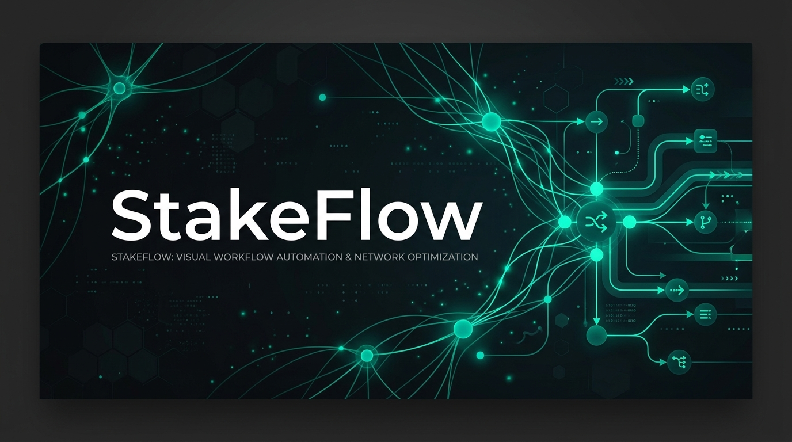
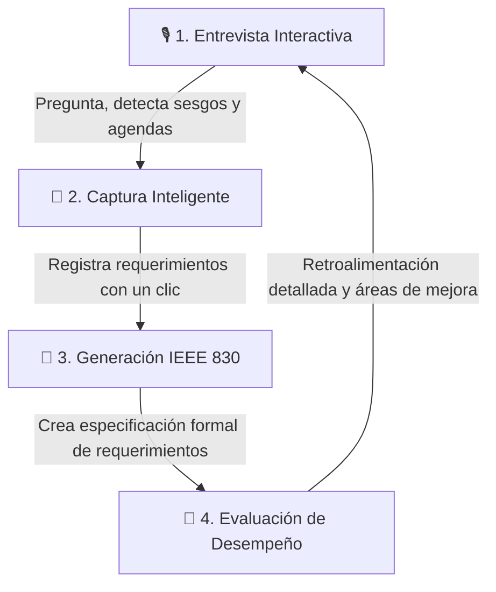

# StakeFlow — Elevando la Elicitación de Requerimientos con IA

  

### Entrena tu capacidad de análisis con stakeholders simulados por IA de alta fidelidad.

  
  
  

---

## 🌟 La Visión detrás de StakeFlow

En el desarrollo de software profesional, los requerimientos rara vez se entregan estructurados; provienen de personas reales con emociones, agendas ocultas y sesgos cognitivos. **StakeFlow** es una plataforma interactiva diseñada para cerrar la brecha entre la teoría de ingeniería de software y el trato profesional con clientes en el mundo real.

Perfecciona tus técnicas de entrevista interactuando con clientes y patrocinadores desafiantes en un entorno seguro y controlado, ahora potenciado por la última generación de modelos de lenguaje de Anthropic Claude.

---

## 🚀 Innovaciones en la Versión 4.0 (Sistema Nuevo)

Hemos actualizado y optimizado el motor del sistema para ofrecer una inmersión y precisión sin precedentes:

*   **🧠 Cerebro Claude 4.6 (Nuevo Fix):** Migración y corrección de compatibilidad al modelo oficial `claude-sonnet-4-6`, resolviendo el problema del modelo descontinuado anterior (`claude-sonnet-4-20250514`). Esto garantiza respuestas con matices psicológicos profundos y una lógica de negocios superior.
*   **✨ Interfaz Zinc Dark 2.0:** Un refinamiento estético completo basado en *Glassmorphism*, paletas sofisticadas oscuras y tipografías Geist Sans / JetBrains Mono que disminuyen la fatiga visual.
*   **🛠️ Asistente de Configuración Guiada:** Nuevo flujo interactivo en 4 pasos (Bienvenida, Conexión, Escenario y Dificultad) para iniciar simulaciones en segundos.
*   **🎯 Captura Inteligente con Un Clic:** Registra Requerimientos Funcionales (RFs) detectados directamente desde la conversación sin romper el flujo de la entrevista.
*   **🎭 Personalidades Dinámicas:** Simulación de stakeholders con perfiles psicológicos únicos. Evaden preguntas, exigen tecnicismos o cambian de opinión según el nivel seleccionado (Junior, Semi-Senior, Senior).

---

## 🎭 Escenarios de Entrenamiento

| Escenario | Sector | El Desafío | Perfiles Clave |
| :--- | :--- | :--- | :--- |
| **🏥 Clínica de Salud** | Salud | Digitalización de flujo operativo bajo presión legal. | Dr. Roberto (Dueño), Laura (Admin), Carlos (Recepcionista) |
| **🍽️ Cadena Gastronómica** | Gastronomía | Control de pérdidas y fugas en una cadena sin POS. | Martín (Inversionista), Sofía (Gerente), Diego (Cajero) |
| **🏫 Campus Académico** | Educación | Modernización de portal de servicios para 8k alumnos. | Dra. Elena (Rectora), Ing. Gómez (Sistemas), Ana (Alumna) |
| **💪 Smart Gym Hub** | Fitness | Optimización de control de accesos y retención de socios. | Sr. Alejandro (Inversionista), Valeria (Gerente), Lucas (Staff) |

---

## 🔄 Ciclo Elicitación Profesional

---

## 🛠️ Stack Tecnológico

*   **Core:** HTML5 + JavaScript (ES6+ sin dependencias externas pesadas).
*   **Inteligencia Artificial:** Anthropic Claude API (`claude-sonnet-4-6`).
*   **Diseño Visual:** Glassmorphism + Zinc CSS System.
*   **Recursos:** Lucide Icons (Iconografía vectorial moderna).
*   **Tipografía:** Geist Sans (Legibilidad) + JetBrains Mono (Datos y Código).

---

## ⚡ Cómo Empezar en 30 Segundos

1.  **Obtén tu API Key:** Regístrate y genera una clave en la [Consola de Anthropic](https://console.anthropic.com/).
2.  **Lanza la Aplicación:** Abre el archivo [index.html](file:///Users/root1/Desktop/stakeflow/index.html) en cualquier navegador moderno.
3.  **Configura y Entrena:** Introduce tu API Key, selecciona un escenario de entrenamiento, el nivel de dificultad, ¡y que comience la elicitación!

---

## 👥 Colaboradores / Contributors

*   **Claude** - IA Elicitadora y Asistente de Desarrollo.

---

*Desarrollado para entrenar a la próxima generación de Ingenieros de Software.*